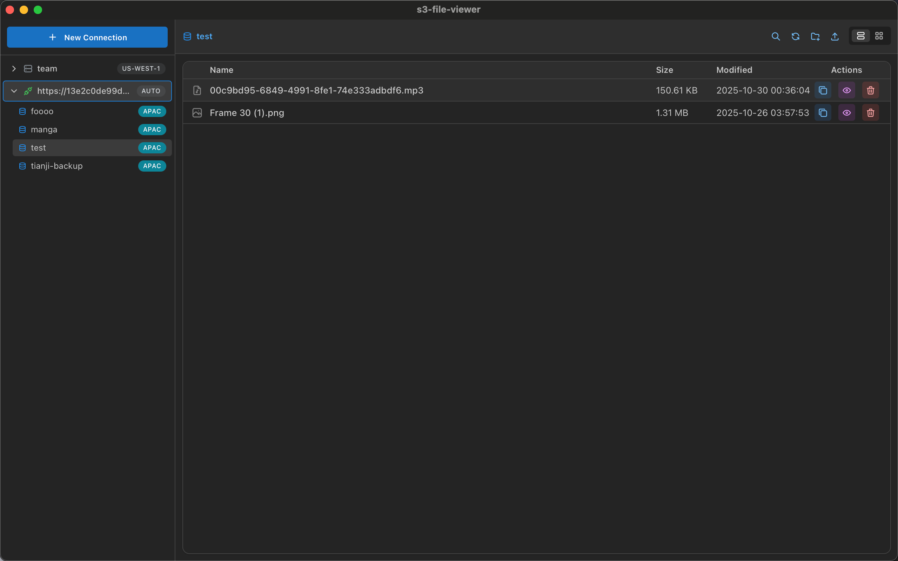
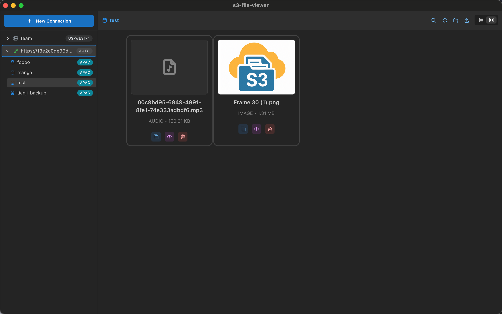

# S3 File Viewer

[](https://opensource.org/licenses/MIT)
[](https://github.com/moonrailgun/s3-file-viewer/releases)
[](https://github.com/moonrailgun/s3-file-viewer/actions)
[](https://github.com/moonrailgun/s3-file-viewer)
[](https://tauri.app)
[](https://reactjs.org)
[](https://www.rust-lang.org/)

<!-- [](https://github.com/moonrailgun/s3-file-viewer/releases) -->

A Tauri + React based S3-compatible object storage browser that provides an intuitive graphical interface to manage and browse your S3 bucket contents.

## 📸 Screenshots

<table>
  <tr>
    <td width="50%">
      <h3 align="center">List View</h3>
      <p align="center">
        
      </p>
      <p align="center"><em>Browse your S3 files with detailed information</em></p>
    </td>
    <td width="50%">
      <h3 align="center">Thumbnail View</h3>
      <p align="center">
        
      </p>
      <p align="center"><em>Visual card layout for easy file browsing</em></p>
    </td>
  </tr>
</table>

## 🎬 Demo Videos

<table>
  <tr>
    <td width="50%">
      <h3 align="center">File Browsing & Management</h3>
      <p align="center">
        <video src="./docs/public/video1.gif" width="100%" controls>
          Your browser does not support the video tag.
        </video>
      </p>
      <p align="center"><em>Browse buckets, upload files, and manage your S3 storage</em></p>
    </td>
    <td width="50%">
      <h3 align="center">File Preview & Operations</h3>
      <p align="center">
        <video src="./docs/public/video2.gif" width="100%" controls>
          Your browser does not support the video tag.
        </video>
      </p>
      <p align="center"><em>Preview images, copy URLs, and switch between views</em></p>
    </td>
  </tr>
</table>

## ✨ Features

- 🔐 **Multi-Connection Management** - Support for saving and managing multiple S3 connection configurations
- 📁 **File Browsing** - Intuitive folder and file browsing interface
- 👀 **File Preview** - Support for previewing files such as images
- 📋 **Clipboard Integration** - One-click copy file URLs to clipboard
- 🗂️ **Dual Views** - Switch between list view and thumbnail view
- ⬆️ **File Upload** - Support for uploading files to S3
- 🌐 **S3 Compatible** - Support for AWS S3 and other S3-compatible storage services (like MinIO)
- 🖥️ **Cross-Platform** - Support for Windows, macOS, and Linux

## 📦 Main Features

### Connection Management
- Support for custom S3 endpoints (AWS S3, MinIO, etc.)
- Secure storage of access keys and secrets
- Connection history and quick reconnection
- Automatic recording of last used time

### File Operations
- Browse buckets and folders
<!-- - Drag and drop file upload -->
- Delete files and folders
- Create new folders
- Generate temporary access URLs (presigned URLs)

### User Interface
- Responsive design for different screen sizes
- Dark mode support
- Breadcrumb navigation
- File thumbnail preview
- Modal image preview
- Loading states and error notifications

## 🚀 Development Setup

### Prerequisites
- [Rust](https://rustup.rs/) (latest stable version)
- [Node.js](https://nodejs.org/) (v18+)
- [Bun](https://bun.sh/)

### Install Dependencies

```bash
cd s3-file-viewer
bun install
```

### Development

#### Desktop Development
```bash
bun tauri dev
```

### Build Production Version

```bash
bun tauri build
```

## 📋 Usage Guide

1. **Initial Connection**
   - After launching the app, enter your S3 configuration in the connection form
   - Endpoint: URL of your S3 service (e.g., `https://s3.amazonaws.com` or your MinIO address)
   - Access Key and Secret Key: Obtain from your S3 service
   - Region: Region where your S3 bucket is located

2. **Browse Files**
   - After successful connection, select the bucket you want to browse
   - Use breadcrumb navigation or double-click folders to enter subdirectories
   - Switch between list view and thumbnail view

3. **File Operations**
   - **Upload**: Click the upload button to select files
   - **Delete**: Use right-click menu or action buttons to delete files
   - **Preview**: Double-click image files or use the preview button
   - **Copy Link**: Copy the temporary access URL of the file

4. **Manage Connections**
   - The app automatically saves your connection configurations
   - Quickly select previously saved connections in the connection interface
   - Support for deleting unwanted connection configurations

## 🔧 Configuration

### S3 Compatibility
This application supports all S3-compatible object storage services, including:

- Amazon S3
- MinIO
- DigitalOcean Spaces
- Alibaba Cloud OSS (S3 API)
- Other S3-compatible services

## 🤝 Contributing

Bug reports and feature requests are welcome!

## 📄 License

This project is licensed under the MIT License - see the [LICENSE](LICENSE) file for details.

## 🎯 Developer

Developed and maintained by [moonrailgun](https://github.com/moonrailgun).

## 🔗 Related Links

- [Tauri](https://tauri.app/) - Application framework
- [React](https://reactjs.org/) - UI library
- [Mantine](https://mantine.dev/) - Component library
- [AWS SDK for Rust](https://aws.amazon.com/sdk-for-rust/) - S3 integration
